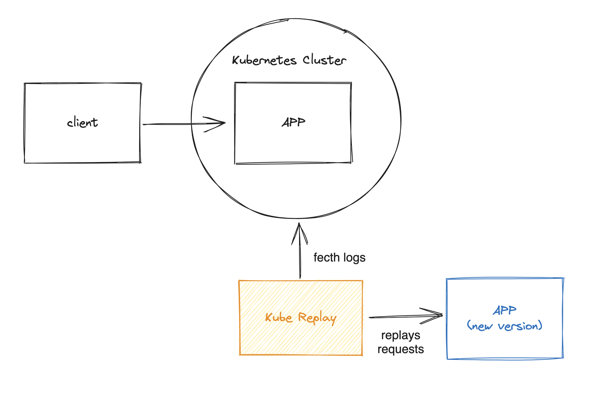

# Kube Replay

This project was inspired by the Netflix's article [Migrating Critical Traffic At Scale with No Downtime](https://netflixtechblog.com/migrating-critical-traffic-at-scale-with-no-downtime-part-1-ba1c7a1c7835).

Kube Replay watches Kubernetes logs to fetch the GET HTTP requests made at the specified container in realtime and replays it at a given HTTP target.



Notes:
- The log pattern should be specified so the match uses named captures `PATH`, `VERB` and `CODE` so the Log Watcher matches the log line correcly. Ex:

    - The regex
    ```
    /(\S+)\s+(\S+)\s+(\S+)\s+(\[.*?\])\s+"(?<VERB>\S+)\s+(?<PATH>\S+)\s+(\S+)"\s+(?<CODE>\S+)\s+(?<SIZE>\S+)\s+(\S+)\s+(\S+)/
    ```

    - Matching log line
    ```
    10.0.0.1 - - [20/Jul/2023:14:08:36 +0000] "GET /my-path HTTP/1.0" 200 123456 "-" "-"
    ```

- Kube Replay will use the current Kubernetes context (TODO: allow user to pass custom context)

## TODO
- Verify Kubernetes Cluster connection
- Add timeout to requests
- Optionally write output to file
- Allow to show only the failed requests at the STDOUT
- Match only GET requests
- Standardize regexp pattern to have match named groups
- Show memory usage and requests heap size
- STDIN commands to exit program instead of using Keyboard Interrupt (ctrl + shift + c)


## Installing

```
gem install kube-replay
```

## Running

```
kube-replay --help
kube-replay --config_file/-f kube_replay_conf.yaml
kube-replay --namespace live --pod live-packager-even-zfhgw --container unified-origin --log_regex_pattern /(\S+)\s+(\S+)\s+(\S+)\s+(\[.*?\])\s+"(\S+)\s+(\S+)\s+(\S+)"\s+(\S+)\s+(\S+)\s+(\S+)\s+(\S+)/ --target_url http://live-packager-1.video.dev.globoi.com
kube-replay -n live -p live-packager-even-zfhgw -c unified-origin -r /(\S+)\s+(\S+)\s+(\S+)\s+(\[.*?\])\s+"(\S+)\s+(\S+)\s+(\S+)"\s+(\S+)\s+(\S+)\s+(\S+)\s+(\S+)/ -t http://live-packager-1.video.dev.globoi.com
```

## Developing

### Install Requirements
```
rbenv install 3.1.3
bundle install
```
